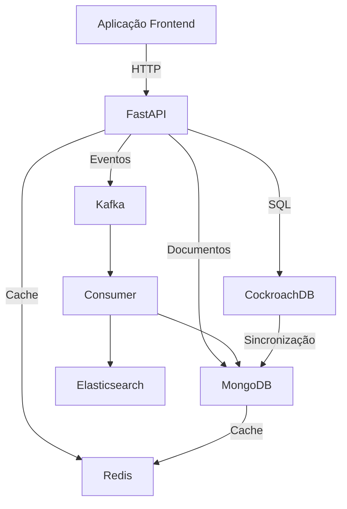

# 🎵 Cypher Music - Sistema de Recomendação Musical
<p align="center">
  
</p>

## 🚀 Visão Geral

O Cypher Music é início um sistema inteligente de recomendação musical que combina tecnologias modernas para criar uma experiência personalizada de descoberta de músicas. O projeto utiliza:

- **FastAPI** para a API principal
- **Kafka** para processamento de eventos em tempo real
- **CockroachDB** (PostgreSQL) para dados de usuários
- **MongoDB** para dados de músicas
- **Redis** para cache
- **Elasticsearch** para logging e monitoramento

## ✨ Funcionalidades Principais

- 🎧 Sistema de recomendação baseado em preferências do usuário
- 🔍 Integração com a API do Spotify para busca de músicas
- 📊 Dashboard de monitoramento em tempo real
- 🔄 Processamento assíncrono de eventos com Kafka
- 📈 Análise de logs e métricas de desempenho

## 🛠️ Pré-requisitos

Antes de começar, você precisará ter instalado:

- Python 3.8+
- pip (gerenciador de pacotes Python)

## ⚙️ Configuração do Ambiente

1. **Baixe o DBase.zip e faça a descompactação do arquivo**:
   ```bash
   git clone https://github.com/StellaOli/DBAvan-ado.git
   ```
2. **Instale as dependências**:
   ```bash
   pip install -r requirements.txt
   ```


## 🏃 Executando o Projeto

1. **Inicie o servidor principal**:
   ```bash
   python main.py
   ```

2. **Acesse a aplicação**:
   Abra seu navegador **EM GUIA ANÔNIMA** [http://localhost:8001](http://localhost:8001)

3. **Serviços adicionais**:
   - API: roda na porta 8000
   - Consumer: processa mensagens do Kafka
   - Monitor: coleta métricas e gera alertas

## 📚 Guia de Uso

1. **Cadastro de Usuários**:
   - Acesse `/users/create` para criar um novo perfil
   - Defina seus gêneros musicais preferidos

2. **Busca de Músicas**:
   - Use `/spotify/search` para encontrar músicas na plataforma Spotify
   - Adicione músicas à sua biblioteca

3. **Recomendações**:
   - Solicite recomendações baseadas em suas preferências
   - O sistema analisa seu histórico e sugere novas músicas

4. **Monitoramento**:
   - Acesse `/monitor` para ver o status dos serviços
   - Verifique métricas de desempenho e logs

## 🎥 Vídeo Explicativo

Assista ao nosso tutorial completo no YouTube:

[](https://www.youtube.com/watch?v=O7-fIpWpSi0)

## 📦 Estrutura do Projeto

```
cypher-music/
├── main.py            # Aplicação FastAPI principal
├── s1_api.py          # Serviço de API
├── s2_consumer.py     # Consumidor Kafka
├── s3_monitor.py      # Serviço de monitoramento
├── connections.py     # Conexões com bancos de dados
├── static/            # Arquivos estáticos (CSS, JS)
├── templates/         # Templates HTML
├── requirements.txt   # Dependências do projeto
└── README.md          # Este arquivo
```


# 🗃️ Arquitetura de Bancos de Dados do Cypher Music

## Por que múltiplos bancos de dados?

O Cypher Music utiliza uma abordagem **polyglot persistence**, selecionando o banco de dados mais adequado para cada tipo de dado e padrão de acesso. Veja a estratégia por trás de cada escolha:

---

## 🐓 **CockroachDB (PostgreSQL) - Dados de Usuários**
**Por que escolhemos?**  
- 💪 **Consistência forte**: Para dados críticos como informações de usuários e preferências  
- ✍️ **Transações ACID**: Garantia em operações como criação/atualização de perfis  
- 🔍 **Consultas complexas**: Facilidade para JOINs e análises relacionais  
- ☁️ **Multi-região**: Capacidade nativa de distribuição geográfica (importante para escalabilidade)  

**O que armazenamos?**  
- Perfis de usuários  
- Preferências musicais  
- Relacionamentos básicos  

---

## 🍃 **MongoDB - Dados de Músicas e Recomendações**
**Por que escolhemos?**  
- 🎵 **Estrutura flexível**: Músicas têm metadados variáveis (álbum, artistas, gêneros)  
- 🚀 **Desempenho em leitura**: Ideal para consultas rápidas de catálogo  
- 📈 **Escala horizontal**: Facilidade para lidar com crescimento do catálogo  
- 🔗 **Agregações ricas**: Pipeline para gerar recomendações personalizadas  

**O que armazenamos?**  
- Catálogo completo de músicas  
- Histórico de reprodução  
- Likes/dislikes  
- Modelos de recomendação  

---

## 🔴 **Redis - Cache e Sessões**
**Por que escolhemos?**  
- ⚡ **Latência ultrabaixa**: Respostas em milissegundos para buscas frequentes  
- 🎯 **Cache inteligente**: Reduz carga nos bancos primários  
- ⏱️ **Expiração automática**: Ideal para sessões temporárias  
- 📊 **Estruturas de dados ricas**: Sets para recomendações em tempo real  

**O que armazenamos?**  
- Cache de buscas no Spotify  
- Sessões de usuários ativos  
- Recomendações temporárias  
- Filas de processamento  

---

## 📊 **Elasticsearch - Logs e Monitoramento**
**Por que escolhemos?**  
- 🔎 **Busca full-text**: Para análise detalhada de logs  
- 📉 **Visualização temporal**: Monitoramento de padrões ao longo do tempo  
- 🚨 **Alertas em tempo real**: Detecção de anomalias no sistema  
- 📈 **Escalabilidade**: Lida com grandes volumes de dados de telemetria  

**O que armazenamos?**  
- Logs de aplicação  
- Métricas de desempenho  
- Eventos de recomendação  
- Alertas do sistema  

---

## 🔄 **Kafka - Fluxo de Eventos**
**Tecnicamente não é um banco**, mas é crucial para:  
- 💾 **Buffer persistente**: Mantém eventos mesmo durante falhas  
- 🔁 **Processamento assíncrono**: Desacopla componentes do sistema  
- 📡 **Streaming em tempo real**: Para atualizações instantâneas de recomendações  

**O que trafega?**  
- Ações de usuários  
- Solicitações de recomendação  
- Eventos do sistema  

---

## 🌐 **Visão Integrada**


Cada banco foi escolhido para **maximizar desempenho**, **garantir confiabilidade** e **permitir escalabilidade** em sua área específica, formando um ecossistema completo para recomendações musicais inteligentes.

## ✉️ Alunos

Luís Marim - 22.224.018-6 </br>
Stella Oli - 22.125.082-2
---

Feito com ❤️ e Python! 🐍
